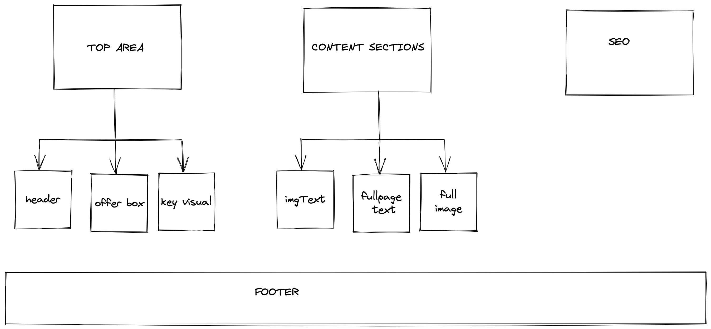

## Proposed Directory Structure

```bash
├── src
│    ├── templates
│         ├── Offerpage.tsx
│    ├── components
│         ├──Seo.tsx
│         ├──LoginButton.tsx
│         ├──KeyVisualContainer.tsx
│         ├──TopArea.tsx   # container for top-area components
│         ├──ContentSections.tsx  # container for content-section components
│         ├──sections
│            ├── content-sections
│                ├── FullImageSection.tsx
│                ├── FullTextSection.tsx
│                ├── ImageTextSection.tsx
│                ... # More content-section components to come
│            ├── top-area
│                ├──HeaderSection.tsx
│                ├──LeftySection.tsx
│                ...# More top-area components to come
│    ├── variants
│        ├──[tenant]
│           ├──create.tsx # exports all variant elements (styles,themes,footer etc)
│           ├──styles.css # variant styling
│           ... # other variant elements
│        ├──provider.tsx  # exports useVariant hook
...
[+ Other Files]
```

## Proposed Template Component Structure for all tenants

The idea here is to have the structure similar to the data received from kitchen.

```js
<Seo>
<TopArea/>
<ContentSections/>
<Footer/>  //not coming from kitchen for now
```

## Deli Structure


